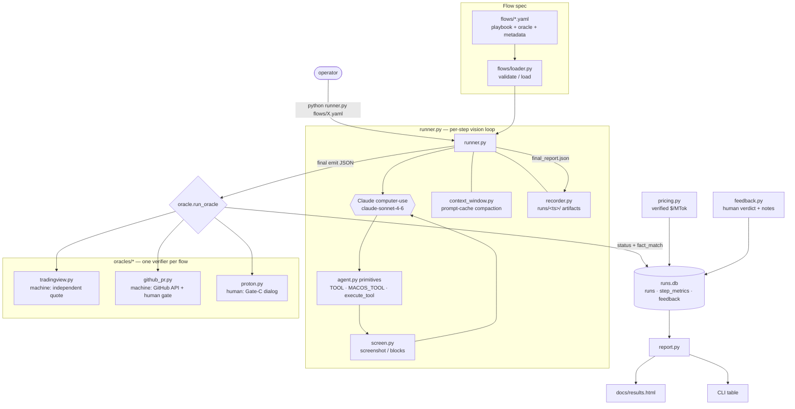

# COA-Test — Architecture & Demo Guide

**Companion to [PLAN.md](PLAN.md)** (the design decisions), [flows.html](flows.html) (the visual
brief — tabbed overview + interactive architecture diagrams), and [results.html](results.html) (the
live metrics). This doc covers *how the system is built*, *how a run flows through it*, the *results so
far*, and a *manager demo script*. All numbers here are pulled from `runs.db` — measured, not
placeholders.

---

## 1. What this is

A small harness that runs **predefined, written-down flows** on a real macOS desktop via a
vision-driven computer-use agent (Claude `claude-sonnet-4-6`), and **measures every run** for
cost, accuracy, and token usage. It inverts the predecessor system's "navigates however it
wants" autonomy into **three deterministic flows across three app *types*** (browser, no-API,
multi-app), each scored by a per-flow **oracle** and recorded one-row-per-run in SQLite.

The headline question it answers, per flow and per app-type: *how reliable is it, what does a run
cost, and how many tokens does it burn?*

---

## 2. System architecture

Two execution paths share the same perception/action primitives:

- **`agent.py`** — the original *free-form, human-gated* agent (three review gates). Used for the
  gated demo/showcase experience.
- **`runner.py`** — the *deterministic, measured* flow runner. Drives a fixed YAML playbook
  step-by-step, reuses `agent.py`'s primitives so action semantics are identical, measures every
  step, scores the run with an oracle, and writes a `runs.db` row. **This is the COA-flows
  framework.**



---

## 3. Components

| File | LOC | Responsibility |
|---|---:|---|
| `runner.py` | 290 | Deterministic flow runner: drive the playbook step-by-step, measure per-step tokens/time/actions, run the oracle, write the `runs.db` row + `final_report.json`. |
| `flows/loader.py` | — | Parse + **fail-fast validate** a YAML spec (`validate()` pure; `load()` adds the file read). |
| `flows/tradingview.yaml` · `flows/proton.yaml` | — | The playbooks: ordered sub-goals + oracle config + metadata (`app_type`, `model`, `mode`). |
| `flows/ta_patterns.json` | — | 18-pattern TA catalog injected into Flow #1's analyze step (fixed, checkable vocabulary). |
| `oracles/tradingview.py` | — | **Machine oracle**: multi-source quote fetch + structural checks. `evaluate()` pure. |
| `oracles/proton.py` | — | **Human-gate oracle**: pops `review.request_final_review`; the human's click is the status. |
| `metrics_db.py` | 144 | SQLite store (`runs` / `step_metrics` / `feedback`) + `insert_*` + `aggregate()`. Stdlib only. |
| `pricing.py` | 51 | Verified per-model `$/MTok` table (`claude-sonnet-5` intro rates + legacy `claude-sonnet-4-6`) + `cost_usd(usage, model)`. |
| `report.py` | 203 | One query pass → CLI markdown table **and** `docs/results.html` (cross-app-type comparison). |
| `feedback.py` | 64 | Capture-only human verdict (may override the oracle) + notes → `feedback` table. |
| `agent.py` | 568 | Predecessor agent: vision loop, native tools, HITL gates. `runner.py` reuses its primitives. |
| `review.py` | 587 | Human-in-the-loop gates (A: plan, B: per-action by risk, C: final review). Proton's oracle reuses Gate C. |
| `screen.py` · `native_actions.py` · `context_window.py` · `recorder.py` | 69/158/58/34 | Screenshots & content blocks · macOS host primitives (activate app, AppleScript, shell) · prompt-cache compaction · per-run artifact recorder. |

New runtime dependency over the predecessor: **PyYAML** (spec parsing). Everything else is stdlib
or already present.

---

## 4. Data flow — one measured run

1. `runner.py` loads + validates the spec (`loader.load`).
2. For each step, it hands Claude **one sub-goal** + a fresh screenshot, and lets the model act
   via the `computer` / `macos` tools (`execute_tool`) until it ends the step (`STEP DONE`).
   Conversation history + the rolling prompt cache carry across steps (`context_window.py`).
3. Each step's tokens / time / actions / retries are recorded; screenshots land in `runs/<ts>/`.
4. The **final step emits a JSON object** (the flow's `emit_schema`); `runner._extract_emit` parses it.
5. The flow's **oracle scores the emit** → `status` (`pass`/`fail`/`error`) + `fact_match`.
6. `runner` writes one `runs.db` row (cost via `pricing.cost_usd`) + a `final_report.json`.
7. `report.py` rolls up `runs.db` → CLI + `docs/results.html`. `feedback.py` optionally appends a
   human verdict without mutating the oracle's status.

---

## 5. Data model & cost model

`runs.db` (stdlib `sqlite3`, one row per run — **no best-of-N**; stats are queries over history):

- **`runs`** — `status`, `steps`, `retries`, token counts, `cost_usd`, `latency_s`, `fact_match`, `run_dir`, …
- **`step_metrics`** — per-step granular tokens/time/retries.
- **`feedback`** — human verdict + notes, linked to a run; never overwrites `runs.status`.

**Cost** (`pricing.py`, verified `$/MTok`). The default is **`claude-sonnet-4-6`**;
`claude-sonnet-5` is also priced (introductory rates through 2026-08-31) so switching the
default reprices cleanly:

| Model | Input | Output | Cache write (5-min) | Cache read |
|---|---:|---:|---:|---:|
| `claude-sonnet-4-6` (default) | 3.00 | 15.00 | 3.75 | 0.30 |
| `claude-sonnet-5` (option, intro) | 2.00 | 10.00 | 2.50 | 0.20 |

`cost_usd = (in·3 + out·15 + cache_write·3.75 + cache_read·0.30) / 1e6`. Image/screenshot tokens are
already inside the API-reported counts. Headline efficiency metric: **`$ / successful run` =
avg_cost ÷ pass-rate**.

**Pass-rate is computed over *scored* runs only** — `pass / (pass + fail)`. An `error` (the oracle
*couldn't verify* — unreachable quote source, dialog timeout) is infra noise, not an accuracy
failure: it's excluded from the denominator and shown as its own `err` count.

---

## 6. The oracle pattern — the key idea

Every flow ships one **oracle** (`oracles/<flow>.py`) exposing `run_oracle(emit, config)`. The
oracle is the *answer key* — independent of what the agent perceived — and its verification method
is chosen to fit the app type:

| Flow | App type | Oracle | Objective fact |
|---|---|---|---|
| TradingView | `browser` | **Machine-verified** — fetch an independent S&P 500 quote (Yahoo `query1→query2` → CNBC → stooq, with retry) and check the agent's read close is within ±0.5%. | close price |
| Proton | `no_api` | **Human-verified** — no API to check against, so a Gate-C approval dialog pops; the human's Approve/No/Feedback click is the status. | (none — human is the verifier) |

This is the deliberate design point: **machine-verify where you can, human-gate where you can't.**
The browser flow runs fully autonomously with a machine answer key; the no-API flow keeps a human
approval gate — which revives the original human-in-the-loop safety story while still recording the
same cost/token metrics.

---

## 7. Flows

| # | Flow | App type | Mode | Status | Task |
|---|---|---|---|---|---|
| 1 | `tradingview_spx` | browser | measure | ✅ built, ≥5 live runs | Open SPX chart, set Daily + 4H, read last close, flag TA patterns from a catalog, emit + score vs independent quote. |
| 3 | `proton_mark_read` | no_api | demo | ✅ built, ran green | Native Proton Mail app: select top-5 inbox emails, "Mark as read", emit; **human gate is the oracle**. |
| 2 | *(legacy app TBD)* | legacy | — | ⏳ parked | App not yet chosen. Drop-in once selected: a `flows/*.yaml` + an `oracles/*.py`. |

---

## 8. Results (verified, from `runs.db`)

**Cross-app-type comparison** — the manager-facing headline:

| App type | Runs | Errors | Pass % (scored) | $/run | Avg tokens | Avg steps | Avg time/run |
|---|---:|---:|---:|---:|---:|---:|---:|
| browser (TradingView) | 8 | 1 | **100%** | $1.15 | 360,335 | 24.0 | 285.3s |
| no_api (Proton) | 3 | 1 | **100%** | $0.65 | 212,514 | 16.3 | 292.2s |

Reading: every *scored* run passed. The no-API native-app flow is **~1.8× cheaper and lighter** than
the browser chart-analysis flow (fewer steps, fewer tokens). The two flows now sit almost level on
*time/run* — no_api's **292.2s** edges browser's **285.3s** only because it's dragged up by the one run
where the human approval gate waited (555s); the two *scored* Proton runs averaged **~161s** (vs the
browser scored band of **189–361s**). Time-per-run, like cost, is averaged over *every* run including
the slow outliers — so it tells you what a run costs in wall-clock, not just the happy path.

**Run-to-run variability (steps & time).** The playbook is fixed, but the agent never walks the exact
same path twice. TradingView step counts span **12–52** with a median of **20.0** and a mean of **24.0**
— **right-skewed (+0.99)**: the lone pre-fix thrash run (52 actions) pulls the mean above the median,
while the tuned runs cluster at 12–24. `report.py` renders this as a per-flow dot/strip chart in
`results.html` (each dot a run; solid tick = median, dashed tick = mean — the gap *is* the skew), so a
reviewer can see the spread, not just an average that hides it.

**Accuracy was tight where machine-checked.** TradingView's agent visually read the close at
**7511.34**; the independent answer key said **7511.35** → **0.0001%** error, every run.

**Cost is a tunable, not a constant.** Flow #1's first run thrashed TradingView's timeframe
dropdown: **52 actions / 502s / $2.73**. Switching the playbook to URL-parameter navigation
(`?symbol=SPX&interval=240`) and macOS `open location` (instead of `Cmd+T`, which the page
intercepts) brought scored runs down to a **$0.60–$1.50** band — the cheapest a fresh low of **12
actions / 189s / $0.60**. That's the human-tunes-YAML feedback loop (D7) working: measure → spot the
waste → edit the playbook.

**The human feedback path is exercised.** One passed run carries an override note —
`"Ascending channel is not correct"` — recorded in `feedback` *without* changing the oracle's
`pass` (objective close-price fact held; the human disputed a subjective pattern flag).

> Caveat kept honest: browser `$1.23/run` is inflated by the one pre-fix `$2.73` thrash run, which
> is included in cost-per-run but excluded from pass-rate.

---

## 9. How to run / reproduce

```bash
# offline test suite (no Mac/display/network needed) — 64 tests
for t in tests/test_loader.py tests/test_pricing.py tests/test_metrics_db.py \
         tests/test_oracle_tradingview.py tests/test_oracle_proton.py \
         tests/test_feedback.py tests/test_report.py; do python3 "$t"; done

# a measured run (needs the Mac: display, ANTHROPIC_API_KEY, Screen-Recording + Accessibility perms)
python -u runner.py flows/tradingview.yaml      # browser flow, machine-scored
python -u runner.py flows/proton.yaml           # no_api flow, human-gated → click pass on the dialog

# the report
python report.py                                # CLI table + docs/results.html

# record a human verdict on a run
python feedback.py <run_id> --pass --notes "..."
```

Abort a live run by slamming the cursor into a screen corner (pyautogui FAILSAFE).

---

## 10. Extending — adding a flow (no framework changes)

1. **Drop a playbook** `flows/<name>.yaml`: `name`, `app_type`, `model`, `mode`, ordered `steps`
   (`id` + `goal`), `oracle`, optional `oracle_config` / `emit_schema`.
2. **Drop an oracle** `oracles/<name>.py` exposing
   `run_oracle(emit, config) -> OracleResult(status, fact_match, reasons)`.
3. Run it. The runner, metrics, pricing, and report pick it up automatically — that's how Flow #3
   landed with zero changes to `runner.py` / `metrics_db.py` / `report.py`.

Flow #2 (`github_notion_intake`, multi-app) landed as exactly this drop-in — one YAML + one
oracle, zero framework changes. The parked legacy-app flow would be the same again.

---

## 11. Demo script (for the manager)

A ~10-minute walkthrough that lands the cost/accuracy/token story:

1. **Frame it (30s).** "The old system navigated however it wanted. The ask was to invert that:
   fixed, written-down flows across three app *types*, each measured for cost, accuracy, tokens."
2. **Flow #1 live — browser, machine-verified (3m).** `python -u runner.py flows/tradingview.yaml`.
   Watch the agent open Brave → SPX chart → Daily → 4H, read the close, and flag TA patterns from a
   fixed catalog. End: `STATUS: pass · close 7511.xx vs quote 7511.xx → 0.00xx%`. Point out the
   oracle used an **independent** quote, not the chart it just looked at.
3. **The numbers (1m).** Open [results.html](results.html). Walk the cross-app-type table —
   pass-rate, $/run, $/success, tokens, steps.
4. **The efficiency story (1m).** "First run was \$2.73 and 52 actions. We *measured* the waste,
   edited the playbook to navigate by URL, and the same run is now \$0.73 / 16 actions." Determinism
   and cost are things you tune, with data.
5. **Flow #3 live — no-API native app, human-gated (3m).** `python -u runner.py flows/proton.yaml`.
   Agent drives the **native Proton Mail app**, selects the top-5 emails, marks them read. The
   **approval dialog pops** — "there's no API to verify a mailbox, so the human is the answer key."
   Click **pass**. Note it still logged real cost/tokens.
6. **Feedback loop (30s).** Show a `feedback` note overriding a subjective pattern call while the
   objective oracle verdict stands — humans tune the YAML by hand; no auto prompt-learning.
7. **Close (30s).** Two of three app types live; the legacy column is the same drop-in (a YAML + an
   oracle) once the app is picked.

---

## 12. Testing (T1–T7, 64 offline tests)

`loader` (T1, 8) · `pricing` (T2, 4) · `metrics_db` (T3, 11) · `oracle_tradingview` (T4, 22) ·
`oracle_proton` (T4′, 9) · `feedback` (T6, 3) · `report` (T7, 7). All network/dialog touchpoints are
dependency-injected, so the suite runs with no Mac, display, or network. The live runner (T5) is
exercised by the real runs recorded in `runs.db`.

---

## 13. Permissions & environment — replicating on another Mac

Everything below is what a *fresh* Mac needs to reproduce a run. **No `sudo` and no admin account
are required for the two demo flows.**

**Runtime prerequisites**

| Need | Detail |
|---|---|
| OS | macOS (Apple Silicon or Intel), a logged-in GUI session with a display. |
| Python | 3.x + `pip install -r requirements.txt` (`anthropic`, `pyautogui`, `pillow`, `python-dotenv`, `pyyaml`). |
| API key | `ANTHROPIC_API_KEY` in `.env` (gitignored — never committed). |
| Target apps | **Brave** installed (Flow #1) and the **native Proton Mail app** installed *and logged in* (Flow #3). |
| Terminal | Run from **Terminal.app / iTerm**, not the VSCode integrated terminal (the runner hides VSCode and the TCC grants attach to the host terminal). |

**macOS privacy permissions (TCC) — granted to the terminal app**, under *System Settings → Privacy
& Security*. Each maps to a concrete thing the agent does:

| Permission | Why it's needed | Where in code | Without it |
|---|---|---|---|
| **Screen Recording** | The agent's *eyes* — every step shoots the screen via `screencapture -x`. | `screen.py · shoot()` | Screenshots come back black/empty; the run fails immediately. |
| **Accessibility** | The agent's *hands* — `pyautogui` synthesizes mouse moves, clicks, keystrokes, scrolls, hotkeys. | `agent.py · execute_tool()` | Clicks/typing are silently dropped; the agent "sees" but can't act. |
| **Automation (Apple Events)** | Host primitives — `osascript` to *activate* an app, hide windows via `System Events`, and `open location <url>`. macOS prompts **per target app** (System Events, Finder, Brave, Proton Mail). | `native_actions.py` (`focus_app`, `hide_vscode`, `run_osascript`) | The first Apple Event to each app prompts; deny → that primitive errors out. |

**Why no sudo:** the demo flows install nothing. `native_actions.safe_shell()` hard-refuses `sudo`,
`rm`, `mv /`, `chmod -R`, `chown -R`, `diskutil erase`, and anything outside a read-only allow-list
(`hdiutil`, `open`, `osascript`, `ls`, `mdfind`, `mdls`, `pwd`, `whoami`, `defaults`). The *only* path
that can ever prompt for an admin password is the optional `install_app_from_dmg()` helper (it copies a
`.app` into `/Applications` via `ditto`) — and that is used **only by the parked legacy-app flow**,
never by the browser, multi-app, or Proton flows.

**First-run gotchas**
- macOS shows each permission prompt only when the capability is first exercised, and a freshly granted
  Screen-Recording / Accessibility permission often needs the terminal **quit and reopened** to take effect.
- Run the preflight first: **`python -u agent.py --diagnose`** (in `diagnostics.py`) probes the
  `screencapture` path and `pyautogui` sizing and writes a report to `runs/<ts>/` — it points failures at
  the host (missing TCC grant, Retina/point-size mismatch) *before* you spend tokens.
- Abort any live run by slamming the cursor into a screen corner (`pyautogui.FAILSAFE`).

---

## 14. One-shot demo / screen recording

`demo.sh` runs **both flows back-to-back + the report** in one invocation, sized for a single screen
recording: preflight → TradingView (machine-scored) → regenerate `results.html` → Proton (human-gated,
you click **pass** on the dialog) → regenerate. Start your screen recorder, then:

```bash
./demo.sh                 # both flows + report, with pauses for narration
./demo.sh --tradingview   # just Flow #1
./demo.sh --proton        # just Flow #3
./demo.sh --no-pause      # no narration pauses (unattended)
```

See `docs/DEMO.md` for the full runbook (what to say at each beat, the expected `STATUS: pass` lines,
and the manager talk-track that mirrors §11).
